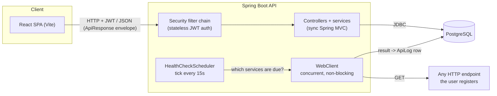
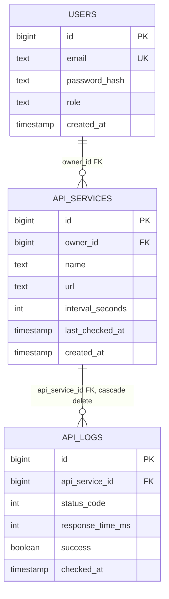

# API Monitoring Dashboard

[](LICENSE)


A self-hosted, multi-user API uptime and latency monitoring platform. Register the
endpoints you care about and it checks them on your own schedule, retries transient
failures before declaring them down, and turns that history into a live dashboard plus
historical analytics — uptime %, latency trends, outage counts, recovery time — all
backed by Postgres, not just whatever happens to be in memory.

## Features

- **JWT authentication** with per-user data ownership — every service and its history
  belongs to exactly one account; another user's data is never reachable, not even to
  confirm it exists (a request for a service you don't own 404s, not 403s).
- **Non-blocking health-check engine** — a scheduler tick checks every due service
  concurrently via a reactive HTTP client, with per-service intervals, timeouts, and
  exponential-backoff retry on transient network failures.
- **SSRF-hardened by default** — every submitted URL is validated against private,
  loopback, link-local, and reserved address ranges (via real DNS resolution, not just
  string matching), re-checked immediately before every single health check, and
  redirects are never followed blindly.
- **Historical analytics** — uptime/downtime percentage, fastest/slowest/average
  response time, and outage + recovery-time detection over a configurable time window.
- **Live dashboard** — status, latency sparklines, and uptime meters per service, with
  search, status filters, and a guided quick-start for new accounts.
- **Docker-first deployment** — one command brings up Postgres, the API, and an
  Nginx-served frontend, wired together with healthchecks.

## Architecture



**Why WebClient instead of RestTemplate:** non-blocking, so N monitored services are
checked concurrently instead of one slow endpoint delaying every check behind it.
Controllers stay plain, synchronous Spring MVC — only the outbound health-check calls
are reactive.

**Why a scheduler "tick" instead of one job per service:** each service has its own
`intervalSeconds`. Rather than one `@Scheduled` task per service (operationally messy,
doesn't scale cleanly), a single lightweight tick runs frequently (default 15s) and
asks "which services are actually due?" — a cheap in-memory filter over service
metadata — then checks only those, concurrently.

## Technology stack

**Backend:** Java 17, Spring Boot 3.2 (Web, WebFlux/WebClient, Data JPA, Security,
Validation, Actuator), PostgreSQL 16, JWT (jjwt 0.12), springdoc-openapi, Lombok, Maven.

**Frontend:** React 18, Vite, React Router, Tailwind CSS, Recharts, lucide-react, axios.

**Infra:** Docker, Docker Compose, multi-stage builds, Nginx (frontend), healthchecks
throughout.

## Quick start with Docker (recommended)

```bash
cp .env.example .env
# REQUIRED: set a real JWT_SECRET in .env - compose refuses to start otherwise.
# Generate one with:  openssl rand -base64 48

docker compose up --build
```

That's the entire setup — no manual PostgreSQL install, no separate migration step.

- **postgres** — Postgres 16, data persisted in a named volume, gated by `pg_isready`.
- **backend** — waits for Postgres to be healthy, exposes `8080`, healthchecked via
  `/actuator/health`.
- **frontend** — Nginx serving the production Vite build, waits for the backend
  healthcheck, exposes `5173`, reverse-proxies `/api/*`, `/actuator/*`, and
  `/swagger-ui*` to the backend container.

Open `http://localhost:5173`, register an account, and add your first service.

## Running locally without Docker

Requires Java 17+, Node 20+, and a local PostgreSQL instance.

```bash
createdb api_monitor

cd api-monitor-backend
export DB_USERNAME=postgres DB_PASSWORD=yourpassword JWT_SECRET=$(openssl rand -base64 48)
mvn spring-boot:run

# separate terminal
cd api-monitor-frontend
cp .env.example .env
npm install
npm run dev
```

(`application.yml` has a fallback JWT secret for exactly this convenience — it's not
production-safe and is never used by the Docker path, which requires `JWT_SECRET`
explicitly.)

## How monitoring works

1. `HealthCheckScheduler` ticks every `monitor.scheduler.fixed-rate-ms` (default 15s).
2. `HealthCheckService` loads every service and filters to those where
   `now - lastCheckedAt >= intervalSeconds` (or never checked).
3. Due services are checked **concurrently** (bounded by
   `monitor.health-check.concurrency`) via WebClient, with a per-request timeout.
   Network-level failures (timeout, DNS, connection refused) retry with exponential
   backoff before being recorded as a failure; a real HTTP error response (4xx/5xx) is
   recorded immediately.
4. Each result is written as one `ApiLog` row, and the service's `lastCheckedAt` is
   updated in the same pass.
5. `GET /api/services/metrics/{id}` aggregates *all-time* logs (DB-side `COUNT`/`AVG`/
   `SUM`, not pulled into the JVM) into uptime %, average latency, and a HEALTHY / SLOW
   / DOWN / UNKNOWN classification.
6. `GET /api/services/{id}/analytics` aggregates a *windowed* view (default last 30
   days, configurable) plus outage/recovery detection: a single forward pass over the
   window's ordered logs finds success→failure→success transitions.

## Database schema



- `api_services.owner_id` is a real FK to `users` — every read/write is scoped to it at
  the repository layer (`findByIdAndOwnerId`, `findAllByOwnerId`), not just filtered in
  the controller, so there's no code path that can leak one user's data to another.
- `api_logs` is indexed on `(api_service_id, checked_at)` — every read pattern (recent
  history, live metrics, windowed analytics) filters and orders on exactly those columns.

## API reference

Every response is wrapped consistently:
```jsonc
{ "success": true, "data": { ... }, "timestamp": "..." }
{ "success": false, "message": "...", "data": null, "timestamp": "..." }
```

Full interactive documentation: **`http://localhost:8080/swagger-ui.html`** once running
(register, log in, click "Authorize", paste the token, try any endpoint from the UI).

| Method | Path | Auth | Description |
|---|---|---|---|
| POST | `/api/auth/register` | Public | Create an account, returns a JWT |
| POST | `/api/auth/login` | Public | Exchange credentials for a JWT |
| POST | `/api/auth/forgot-password` | Public | Request a password reset email |
| POST | `/api/auth/reset-password` | Public | Reset password with a valid token |
| GET | `/api/services` | Bearer | List your monitored services |
| POST | `/api/services` | Bearer | Register a service (`name`, `url`, optional `intervalSeconds`) |
| GET | `/api/services/{id}` | Bearer | Get a single service |
| DELETE | `/api/services/{id}` | Bearer | Remove a service and its history |
| GET | `/api/services/logs/{id}?limit=` | Bearer | Recent check history (chart-ready) |
| GET | `/api/services/metrics/{id}` | Bearer | Live uptime/latency/status |
| GET | `/api/services/{id}/analytics?windowDays=` | Bearer | Historical analytics |
| GET | `/api/services/summary` | Bearer | Count of your monitored services |
| GET | `/actuator/health` | Public | Liveness/readiness |
| GET | `/actuator/info` | Public | Build/app info |

## Environment variables

See `.env.example` for every variable wired through Docker Compose (with the same
defaults `application.yml` falls back to if unset). The ones that matter most:

| Variable | Default | Description |
|---|---|---|
| `JWT_SECRET` | *(required in Docker)* | Signing key for tokens - generate a real random value |
| `JWT_EXPIRATION_MS` | `86400000` (24h) | Token lifetime |
| `DB_URL` / `DB_USERNAME` / `DB_PASSWORD` | localhost / postgres / postgres | Database connection |
| `CORS_ALLOWED_ORIGINS` | `http://localhost:5173` | Comma-separated allowed origins |
| `MONITOR_SCHEDULER_FIXED_RATE_MS` | `15000` | How often the scheduler checks for due services |
| `MONITOR_HEALTHCHECK_DEFAULT_INTERVAL_S` | `60` | Default per-service check interval |
| `MONITOR_HEALTHCHECK_MIN_INTERVAL_S` / `MAX_INTERVAL_S` | `15` / `3600` | Allowed interval range |
| `MONITOR_ANALYTICS_WINDOW_DAYS` | `30` | Default analytics lookback window |
| `VITE_API_BASE_URL` | `http://localhost:8080/api` (dev) / `/api` (Docker) | Frontend API target |

## Screenshots

<!-- Add screenshots here, e.g.:  -->

Not included yet. Run `docker compose up --build`, open `http://localhost:5173`,
and register an account to see it live — the dashboard renders stat widgets (total/
online/offline services, average latency, average uptime) above a searchable service
list with per-row latency sparklines and uptime meters, and each service's detail page
shows a latency chart, an uptime trend chart, and a 30-day analytics panel.

## Notable engineering decisions

A few things worth calling out for anyone reading the code, not just running it:

- **Redirects are never followed on health checks.** The outbound HTTP client
  explicitly disables `followRedirect` rather than relying on the library default — a
  redirect to another host would otherwise never pass through the SSRF validator at
  all, since the destination is a URL it never saw. A 3xx response is simply recorded
  as a failed check.
- **Status is classified from the single latest check, not an average.** Averaging
  would smooth over exactly the signal a status page exists to surface — a service that
  just went down still needs to say "DOWN" immediately, not "mostly fine on average."
- **Outage/recovery detection is a sequential scan, not a `GROUP BY` aggregate**,
  because "how many times did this go down and come back" is fundamentally a
  transition-detection question over ordered rows, not something an aggregate query can
  answer directly. It's a bounded, time-windowed scan (not "all history ever"), which is
  the right scale trade-off for a self-hosted tool's actual data volume.
- **Ownership is enforced at the repository layer, twice.** Every service/log lookup is
  scoped by owner id in the query itself (`findByIdAndOwnerId`), not filtered
  afterward in the controller — and a mismatched id 404s rather than 403s, so it never
  even confirms to a non-owner that a given id exists.

## Production note on schema management

`spring.jpa.hibernate.ddl-auto=update` is convenient for `docker compose up --build`
requiring zero manual steps, which is exactly the point of this Docker setup — but
`update` is not what you'd run against a real production database (it can't handle
destructive changes safely and gives no migration history). A genuine production
deployment should replace it with a real migration tool (Flyway or Liquibase) and
`ddl-auto=validate`.

## Roadmap

Deliberately not implemented in this phase, with the architecture shaped to make each a
contained addition:

- Role-based authorization beyond `USER` (the `Role` enum and `CustomUserDetails`
  authority mapping are already structured for it)
- Email alerts + alert preferences (per-service thresholds on top of the interval/
  retry config that already exists)
- Incident timeline, maintenance windows, public status pages
- Flapping detection (services toggling up/down repeatedly in a short window — the
  outage-transition scan in `AnalyticsService` is most of the groundwork already)
- Flyway/Liquibase migrations (see production note above)
- CI/CD via GitHub Actions
- Prometheus/Grafana (Actuator already exposes a scrapable `/actuator/metrics`
  endpoint)
- Refresh tokens / server-side token revocation

## License

MIT — see [LICENSE](LICENSE).
