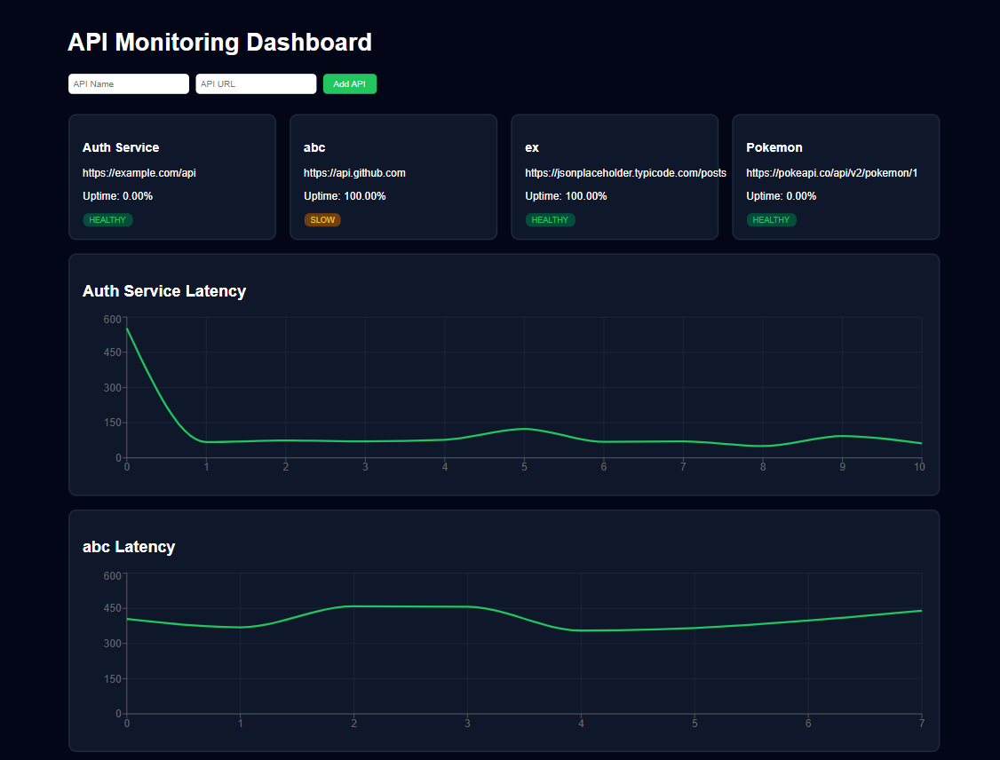

# 🚀 API Monitoring Dashboard

A full-stack **API monitoring and observability platform** that tracks API health, latency, and uptime through automated checks and visualizes the metrics in a real-time dashboard.

The system periodically sends requests to registered APIs, stores response metrics, and displays monitoring insights using interactive charts.

---

# 📊 Dashboard



---

# 🧠 Overview

Modern systems rely heavily on APIs and microservices. If an API becomes slow or unavailable, it can impact the entire application.

This project provides a lightweight monitoring solution that:

✅ Monitors API availability  
✅ Tracks response latency  
✅ Calculates uptime metrics  
✅ Displays monitoring data in a live dashboard

The platform consists of:

- **Spring Boot backend** performing scheduled API health checks
- **React frontend** visualizing monitoring metrics

---

# ✨ Features

### 🔌 API Registration

Add APIs directly from the dashboard to start monitoring.

### ⏱ Automated Health Checks

A backend scheduler periodically sends requests to each API.

### 📈 Latency Monitoring

Records response times and displays them in time-series charts.

### 📊 Uptime Calculation

Computes uptime percentage based on successful responses.

### 🚦 API Health Status

Each API is categorized based on latency:

🟢 **HEALTHY**  
🟡 **SLOW**  
🔴 **DOWN**

### 🖥 Monitoring Dashboard

The dashboard displays:

- API status cards
- latency graphs
- uptime metrics
- monitoring insights

---

# 🏗 Architecture

```
React Dashboard
       │
       ▼
Spring Boot REST API
       │
       ▼
Scheduler Health Checks
       │
       ▼
MySQL Database (API Logs)
```

### 🔄 Workflow

1️⃣ User registers an API from the dashboard  
2️⃣ Backend scheduler periodically sends requests  
3️⃣ Response latency and status are stored in the database  
4️⃣ REST endpoints expose monitoring metrics  
5️⃣ React dashboard visualizes the results

---

# 🛠 Tech Stack

## 🎨 Frontend

- React
- Recharts (data visualization)
- Axios
- Vite

## ⚙️ Backend

- Spring Boot
- Spring Scheduler
- Spring Data JPA
- REST APIs

## 🗄 Database

- MySQL

---

# 📂 Project Structure

```
api-monitoring-dashboard
│
├── api-monitor-backend
│   ├── src/main
│   └── pom.xml
│
├── api-monitor-frontend
│   ├── src
│   ├── index.html
│   ├── package.json
│   └── vite.config.js
│
├── screenshots
│   └── dashboard.png
│
├── README.md
├── LICENSE
└── .gitignore
```

---

# ⚙️ Backend Setup

## 1️⃣ Create Database

```sql
CREATE DATABASE api_monitor;
```

---

## 2️⃣ Configure Database

Edit:

```
api-monitor-backend/src/main/resources/application.properties
```

Example configuration:

```
spring.datasource.url=jdbc:mysql://localhost:3306/api_monitor
spring.datasource.username=root
spring.datasource.password=
spring.jpa.hibernate.ddl-auto=update
server.port=8080
```

---

## 3️⃣ Run Backend

```
cd api-monitor-backend
mvn spring-boot:run
```

Backend will run on:

```
http://localhost:8080
```

---

# 💻 Frontend Setup

## Install Dependencies

```
cd api-monitor-frontend
npm install
```

## Start Development Server

```
npm run dev
```

Frontend runs on:

```
http://localhost:5173
```

---

# 🔗 API Endpoints

### Register API

```
POST /api/services
```

Example request:

```json
{
  "name": "Auth Service",
  "url": "https://api.github.com"
}
```

---

### Get All APIs

```
GET /api/services
```

---

### Get Latency Logs

```
GET /api/services/logs/{serviceId}
```

---

### Get API Metrics

```
GET /api/services/metrics/{serviceId}
```

Example response:

```json
{
  "uptime": 99.2,
  "avgLatency": 120,
  "status": "HEALTHY"
}
```

---

# ⏳ Scheduler

The backend periodically checks API health.

Example:

```
@Scheduled(fixedRate = 60000)
```

Each check records:

- response latency
- HTTP status code
- timestamp

---

# 📊 Example Monitoring Metrics

```
Auth Service
Uptime: 99.3%
Status: HEALTHY

Latency Trend
120 → 140 → 110 → 180 → 130
```

---

# 🚀 Future Improvements

Potential enhancements:

- 🌍 Multi-region monitoring
- 🔔 Alert notifications
- 📊 Latency heatmaps
- 🔐 Authentication support
- 📡 Real-time WebSocket updates
- 📉 Advanced observability metrics

---

# 📜 License

Distributed under the MIT License. See [`LICENSE`](LICENSE) for more information.
